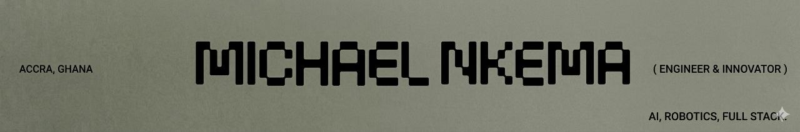

### Hi 👋, I'm Michael

## A multifaceted developer from Ghana

**Computer Engineering Student • Robotics Coach • AI Builder**

[Portfolio](https://mykecodes2026.vercel.app/) • [LinkedIn](https://linkedin.com/in/michael-nkema) • [Hashnode](https://hashnode.com/@Mikecodes)

---

## About Me

I'm a Computer Engineering student who enjoys building things that **think, move, and solve problems**.

My interests sit between **Artificial Intelligence, Robotics, and Full-Stack Development**. Whether it's training a recommendation model, building autonomous robots with ROS, or developing software used by real people, I enjoy turning ideas into working systems.

---

## Currently Building

- **Absense** — Smart attendance system using facial recognition, GPS, and QR verification.
- Autonomous robotics projects
- Full-stack applications with React and FastAPI.

---

## ⚡ Tech Stack

```text
AI / ML      Python • TensorFlow • NLP • CNNs • Gemini API
Frontend     React • Next.js • JavaScript • TailwindCSS
Backend      FastAPI • Django • Flask
Robotics     ROS • Gazebo • RViz • Arduino • C/C++
Tools        Git • Docker • Linux
```

<h3 align="left">Languages and Tools:</h3>

<p align="left">
<a href="https://www.python.org/" target="_blank">

</a>

<a href="https://cplusplus.com/" target="_blank">

</a>

<a href="https://go.dev/" target="_blank">

</a>

<a href="https://www.javascript.com/" target="_blank">

</a>

<a href="https://react.dev/" target="_blank">

</a>

<a href="https://nextjs.org/" target="_blank">

</a>

<a href="https://tailwindcss.com/" target="_blank">

</a>

<a href="https://fastapi.tiangolo.com/" target="_blank">

</a>

<a href="https://flask.palletsprojects.com/" target="_blank">

</a>

<a href="https://www.djangoproject.com/" target="_blank">

</a>

<a href="https://www.tensorflow.org/" target="_blank">

</a>

<a href="https://opencv.org/" target="_blank">

</a>

<a href="https://www.arduino.cc/" target="_blank">

</a>

<a href="https://www.ros.org/" target="_blank">

</a>

<a href="https://gazebosim.org/" target="_blank">

</a>

<a href="https://git-scm.com/" target="_blank">

</a>

<a href="https://github.com/" target="_blank">

</a>

<a href="https://www.docker.com/" target="_blank">

</a>

<a href="https://www.linux.org/" target="_blank">

</a>
</p>

## 🌍 Connect With Me

<p align="left">
<a href="https://twitter.com/mykel_nk11" target="blank">

</a>

<a href="https://linkedin.com/in/michael-nkema" target="blank">

</a>

<a href="https://instagram.com/myke_codes" target="blank">

</a>

<a href="https://hashnode.com/@Mikecodes" target="blank">

</a>

<a href="https://medium.com/michaelnkema1" target="blank">

</a>
</p>

---

## GitHub Stats

<p align="center">
  
</p>

---

> _mykecodes_

<!--
**michaelnkema1/michaelnkema1** is a ✨ _special_ ✨ repository because its `README.md` (this file) appears on your GitHub profile.

Here are some ideas to get you started:

- 🔭 I’m currently working on ...
- 🌱 I’m currently learning ...
- 👯 I’m looking to collaborate on ...
- 🤔 I’m looking for help with ...
- 💬 Ask me about ...
- 📫 How to reach me: ...
- 😄 Pronouns: ...
- ⚡ Fun fact: ...
-->
